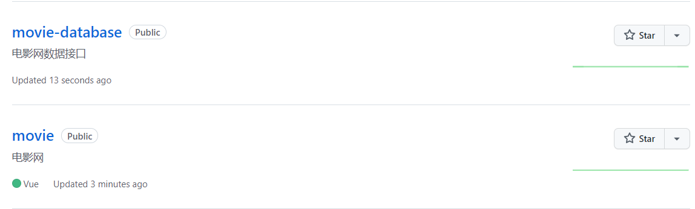

> **Movie -- 电影网**	

#### 项目介绍

“电影网”——展现了正在热映以及即将上映的电影、对电影的详细介绍、影评等信息，在这里面可以搜索影片、收藏影片信息、以及对影片发表评论。

#### 配置

[movie]: https://github.com/zhishouH/movie

- npm install
- npm run server

[movie-database]: https://github.com/zhishouH/movie-database

-  npm install -g json-server
- json-server --watch db.json

关于[**json-server**](https://github.com/typicode/json-server)

#### 设计思路

 

#### 项目结构

#### 项目实现

##### 前期准备

- 代码风格
- stylelint的配置
- jsconfig.json的配置
- 重置默认样式 —— "normalize.css"
- 响应式布局 —— "postcss-px-to-viewport"的使用
- 矢量图标的使用 —— "iconfont"
- UI组件库的使用 —— "Vant-UI"
- 第三方数据请求工具 —— "axios"

##### 代码实现

- 登录 --  在项目中，做了全局路由拦截，必须登录才能进入到电影网中。
- 注册 -- 新用户必须注册之后才能进行登录、并且在注册时有密码校验，只有通过校验才能注册
- 注册成功之后跳转到登录页面，vuex记录了用户名以及密码，展现在输入框中，用户登录即可
- 登录成功跳转至个人中心页面("我的页面")，跳转时Toast提示欢迎+用户名
- 电影页面包括正在热映、即将上映、头部轮播层三个部分，点击影片可跳转至详情页，可收藏、分享
- 搜索页面提供给用户对影片进行搜索的功能，搜索到的影片结果可跳转至详情页
- 社区页面是对影片的评论、可添加评论。
- 个人中心包括我的收藏和我的评论两个功能模块

#### 部分效果

